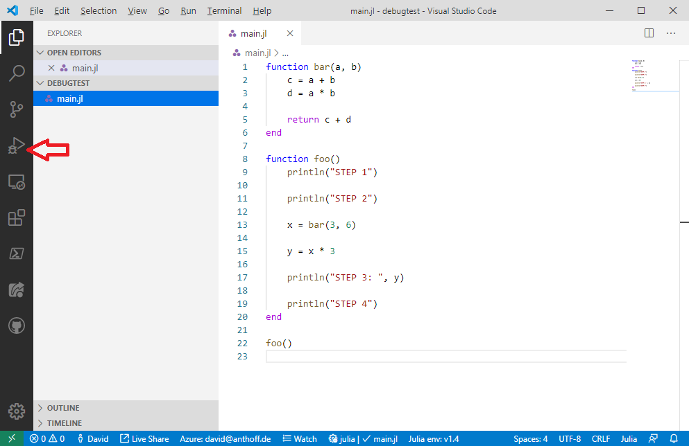
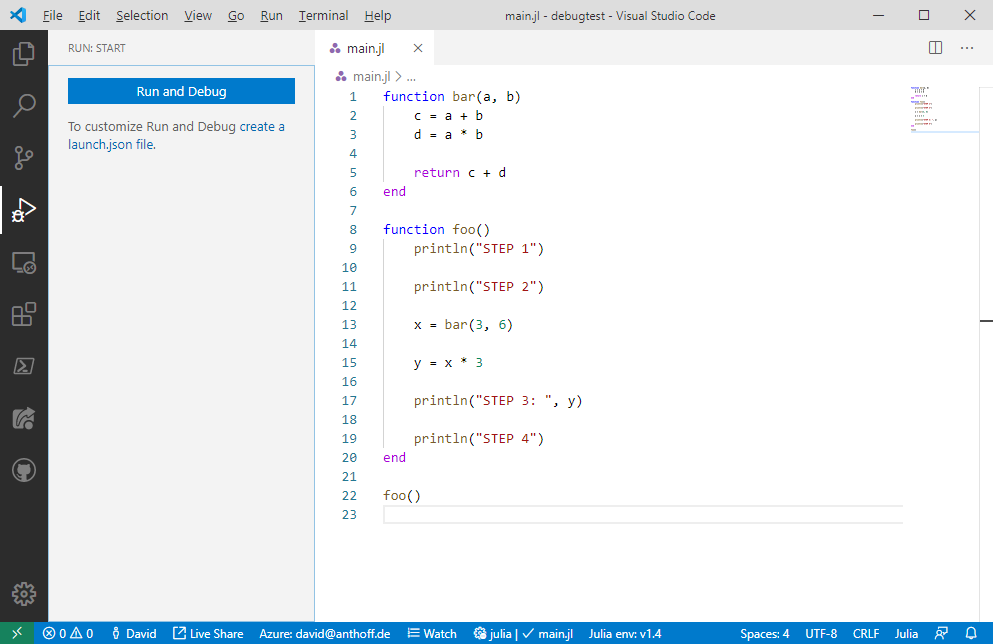
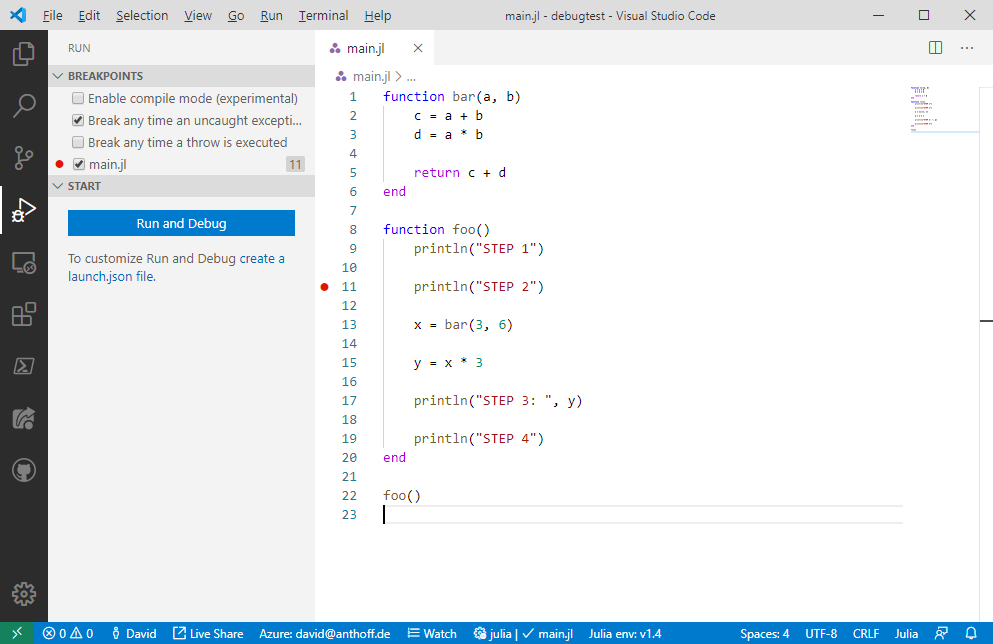
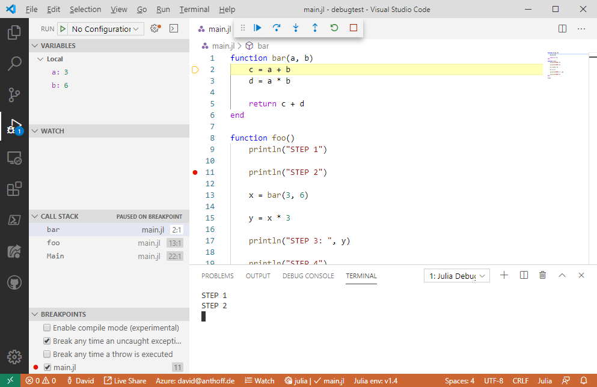
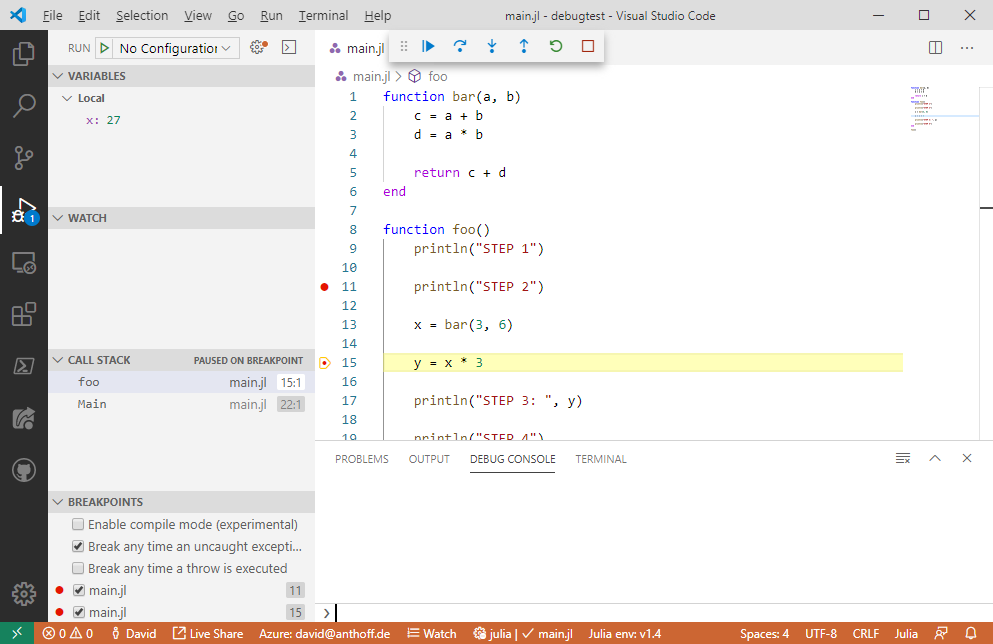
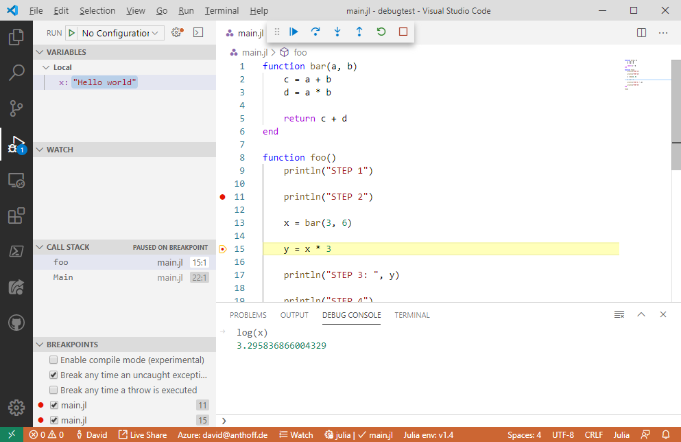
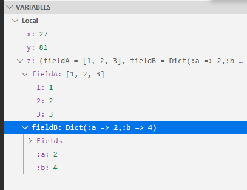
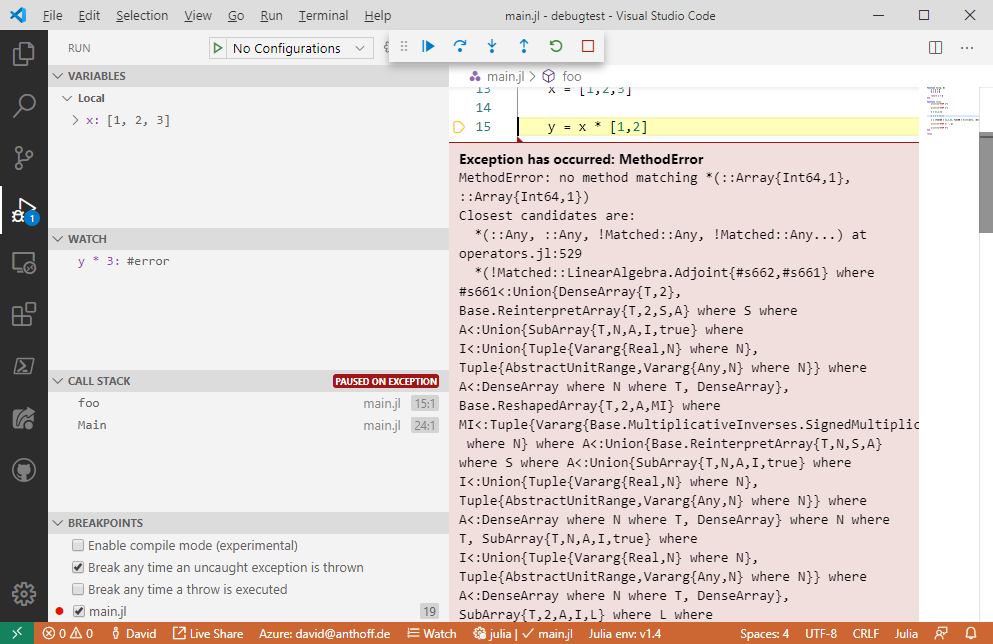

# Debugging

The Julia extension supports debugging of all types of Julia programs and applications. In the document We will be doing a short walkthrough of basic debugging. We will demonstrate core skills of debugging like setting breakpoints and stepping through code.

For general debugging features such as inspecting variables, setting breakpoints, and other activities that aren't language-dependent, review [VS Code debugging](https://code.visualstudio.com/docs/editor/debugging).

### Example

Lets assume you have a simple project with one Julia file open in VS Code:

First you should click on the button for the Run view. You will now see the default debugger start panel:

If you just click on `Run and Debug` (or press `F5`), the current active Julia file will run in the debugger. Output will be shown in a special Julia Debug terminal:

In this example the whole program ran through in one go and finished without any problem. Lets make this example a bit more useful by setting a breakpoint on `line 11`. We do this by simple clicking with the mouse in the left most column of the code editor:

The red dot shows us that we have now set a breakpoint. Next we start the program again (either by clicking on `Run and Debug` or pressing `F5`). When the program reaches `line 11`, it will pause:

The yellow line shows us the location that we will execute next if we continue to run the program. We can also see where we are in the call stack and a list of all breakpoints. At the top of the text editor we now see a toolbar with commands for common debug actions: `Continue`, `Step over`, `Step Into`, `Step Out` etc. Lets click once on `Step Over` and then `Step Into`. We are now paused on the first line of the bar function:

The `Variables` view now shows us what local variables we have in this function and what their current values are. As we step through the program, and eventually reach the end of the bar function, the list of local variables gets longer, i.e. we now also see the values for `c` and `d`:

Let us set another breakpoint on `line 15` and then continue the program until it hits that breakpoint. Then we click on `Debug Console` and see a view like this:

In this view we can evaluate arbitrary Julia code in the context of the current function. For example, we can compute the log of x by running `log(x)` here:

We can also change the value of any local variable while the program is paused. For example, to change the value of x, we can double click in the `Variables` section on the value 27 next to x and then enter any arbitrary Julia expression. The value this expression returns will become the new value for the variable x. In the following example We changed the value of x to a string:

This concludes the very basic walk through. I’ll now want to highlight some other features.

### Ways to start the debugger

There are two different ways to start the debugger.
- The first you already learned in the walk through: you run a Julia file in the debugger.
- The second allows you to debug code in the interactive REPL.

### Running Julia files

In our example we started the currently active Julia file in the debugger. This is the most basic way to start debugging, but there are many more options that you can configure in a VS Code launch.json file. Examples include setting a fixed Julia file as the startup file, configuring command line arguments etc. The launch.json functionality is described in more detail in the VS Code debugger documentation.

### Debugging code from the REPL

You can also start the debugger from the REPL. In that situation the debugger will attach to the already running REPL. To start such a debug session you use two macros in the REPL: the `@enter` and `@run` macro. Both are very simple: they will start the debugger on the code that was passed to the macro. The `@run` macro will run the code until a breakpoint is hit, while the `@enter` macro will pause the debugger on the first line of the code. For example, you can start debugging the println function from the REPL by entering `@enter println("Test")`

### Breakpoints

You already learned how you can easily set breakpoints in the source code itself. There are two more options for breakpoints:
function breakpoints and condition on breakpoints.

### Function breakpoints

If you click on the little `+` sign in the `BREKPOINTS` view, you can add a function breakpoint. Simply enter the name of the function you want to break on. You can also configure it to only break on specific methods by specifying a signature like `foo(::String, ::Number)`.

### Breakpoint conditions

If you click with the right mouse onto a breakpoint in the editor, you can select an option `Edit breakpoint...`, and then you can add a condition on the breakpoint. You can enter any valid Julia expression that returns a `Bool` value here. You have of course full access to all local variables in this expression.

### Variables viewer

Composite variables, arrays and dictionaries have full tree drill down support in the variables viewer:

### Watch section
The watch section allows you to enter arbitrary Julia expressions that are evaluated whenever the program pauses and the result is shown:

### Call stack

The call stack section allows you to look at the content of any stack frame, i.e. when you click on a different function there it will show the local variables for the selected stack frame. You can also restart code execution at any stack frame by clicking the small restart icon next to a given entry here:

Note that this last feature can be quite brittle, in particular if your functions modify any global state.

### Exceptions

If your code throws an exception, you get a nice exception view:

You can also configure the behavior of the debugger in the face of exceptions in the BREAKPOINTS part of the UI.

### Compile mode

The breakpoints view has another option called Enable compile mode:

**The functionality of this option is the following:**

If you select this option, breakpoints that are set in any function that is called from the current stack frame will no longer pause code execution. In our example, if you have paused in function foo and then select this option, a breakpoint in bar would no longer pause execution. Breakpoints in foo would still pause the debugger.

**Why would you ever want to use this feature?**

Your code will run a lot faster with this option enabled.

### Troubleshooting
If you encounter any issue when using the debugger, Please do let us know about it over at the [Julia VS Code](https://github.com/julia-vscode/julia-vscode) repository.
